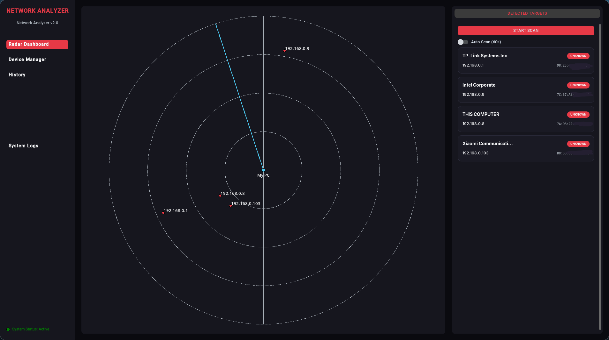
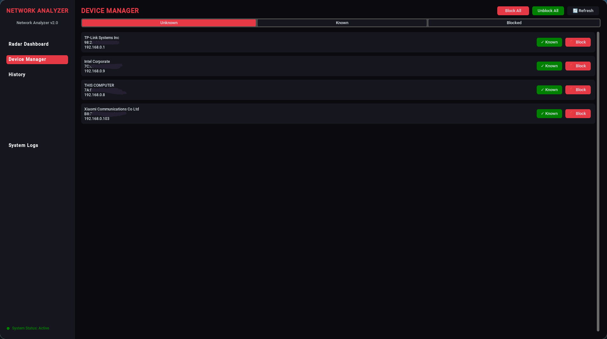
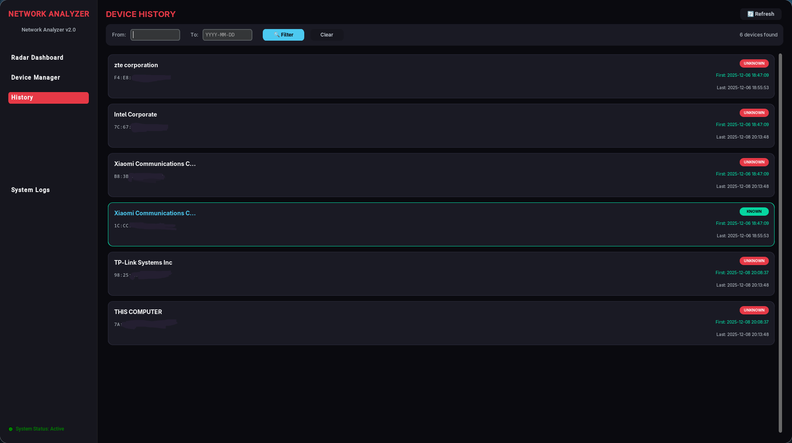

# 🌐 Network Analyzer

A modern, cross-platform network scanning and device management application with a sleek dark-themed GUI.



## 📦 Releases

| Version | Description |
|---------|-------------|
| **Standard** | Lightweight version with local JSON storage |
| **Neo4j Edition** | Advanced version with Neo4j graph database support |

> 💡 **Recommendation:** Use the Standard version unless you need advanced database features.

## ✨ Features

- **🔍 Real-time Network Scanning** - Discover all devices on your local network using ARP + ICMP ping sweep
- **📡 Radar Dashboard** - Visual radar-style display showing connected devices
- **📋 Device Manager** - Mark devices as "Known" or "Unknown", block suspicious devices
- **🚫 Device Blocking** - Block unwanted devices from your network (requires Npcap on Windows)
- **📊 History Tracking** - View device connection history with timestamps
- **🏭 Vendor Detection** - Automatic vendor identification via MAC address lookup (38,000+ vendors)
- **💾 Persistent Storage** - Device statuses and history saved locally (optional Neo4j support)

---

## 🖥️ Installation

### Windows

1. **Install Python 3.10+**
   - Download from [python.org](https://www.python.org/downloads/)
   - ✅ Check "Add Python to PATH" during installation

2. **Install Npcap** (Required for network scanning & blocking)
   - Download from [npcap.com](https://npcap.com/#download)
   - ✅ Check "Install in WinPcap API-compatible Mode" during installation

3. **Install Dependencies**
   ```cmd
   pip install customtkinter scapy requests
   ```

4. **Run the Application** (as Administrator)
   ```cmd
   python main.py
   ```
   > ⚠️ **Important:** Right-click Command Prompt → "Run as Administrator"

---

### Linux (Debian/Ubuntu)

1. **Install Dependencies**
   ```bash
   sudo apt update
   sudo apt install python3 python3-pip python3-tk
   pip3 install customtkinter scapy requests
   ```

2. **Run the Application**
   ```bash
   sudo python3 main.py
   ```

---

### Linux (Arch Linux)

1. **Install Dependencies**
   ```bash
   sudo pacman -S python tk python-scapy python-requests
   pip install customtkinter --break-system-packages
   ```

2. **Run the Application**
   ```bash
   xhost +local:root && sudo python3 main.py
   ```

---

## 📸 Screenshots

### Main (Radar Dashboard)


### Device Manager


### History


---

## 🎮 Usage

1. **Start the App** - Launch with administrator/root privileges
2. **Auto-Scan** - The app automatically scans every 60 seconds (configurable)
3. **Manual Scan** - Click "START SCAN" button for immediate scan
4. **Manage Devices** - Go to "Device Manager" to mark devices as Known/Unknown
5. **Block Devices** - Select a device and click "Block" to prevent network access
6. **View History** - Check "History" tab to see when devices connected

---

## 📁 Project Structure

```
WifiAnalyzer/
├── main.py              # Main GUI application
├── wifi_scanner.py      # Network scanning module (ARP + Ping)
├── wifi_blocker.py      # Device blocking module
├── neo4j_manager.py     # Optional Neo4j database integration
├── .env                 # Neo4j credentials (optional, not tracked)
├── oui.txt              # Vendor database (auto-downloads)
└── README.md
```

---

## ⚙️ Optional: Neo4j Database

For advanced users who want persistent database storage:

1. Install [Neo4j Desktop](https://neo4j.com/download/)
2. Create a `.env` file:
   ```
   NEO4J_URI=bolt://localhost:7687
   NEO4J_USER=neo4j
   NEO4J_PASSWORD=your_password
   ```
3. Install the driver: `pip install neo4j python-dotenv`

---

## 🔒 Security Notes

- This tool requires **administrator/root privileges** for raw socket access
- Device blocking uses ARP spoofing - use responsibly on networks you own
- The app only scans your local network subnet

